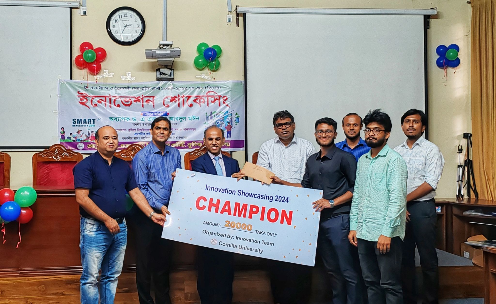
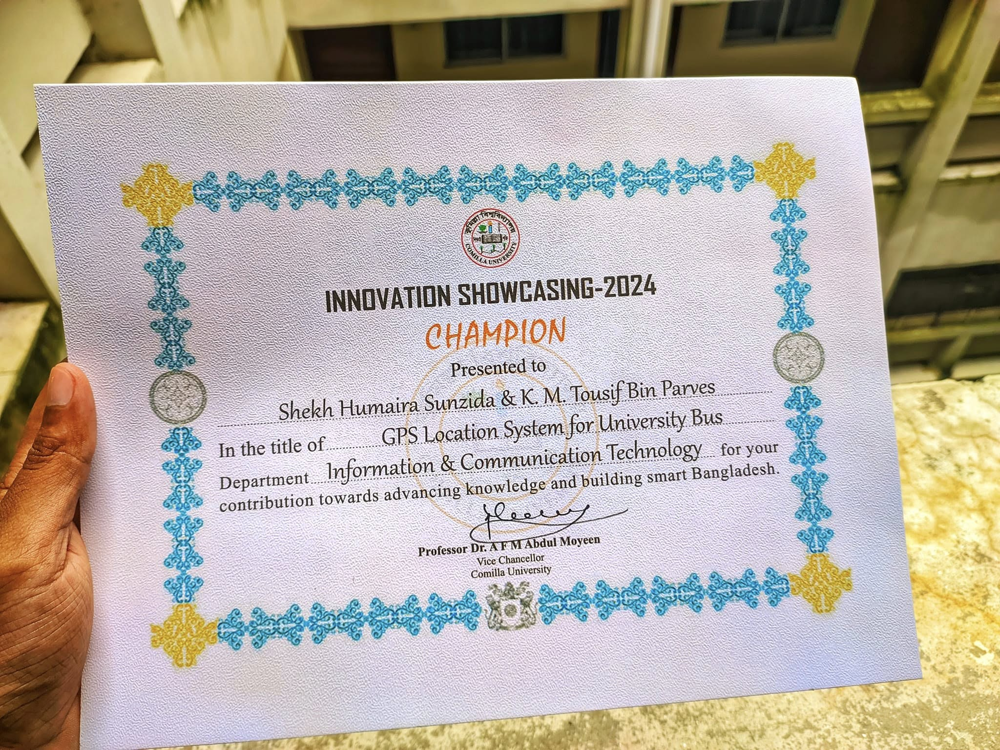

# University Bus Tracking System 🚌

## Overview

The University Bus Tracking System is a sophisticated IoT-based solution designed to track university buses in real-time. The system features live GPS tracking, occupancy monitoring through computer vision, and a web-based interface for real-time monitoring.


## Features

- 🛰️ **Real-time GPS Tracking**: Live location updates of university buses
- 👥 **Smart Occupancy Detection**: Uses computer vision to monitor bus occupancy
- 📸 **Live Camera Feed**: Real-time video streaming from buses
- 🌐 **Web Interface**: User-friendly dashboard for tracking and monitoring
- 🔒 **Secure Communication**: Implements HTTPS for secure data transmission
- 📱 **Cross-platform Compatibility**: Works on both mobile and desktop browsers

## System Architecture

The system consists of three main components:

1. **ESP32-CAM Module** (`BusTrackerESPCam/`)
   - GPS tracking
   - Live camera feed
   - WiFi connectivity
   - Secure data transmission

2. **Server** (`Server/`)
   - Flask-based backend
   - Real-time WebSocket communication
   - Computer vision processing
   - SQLite database for data storage

3. **Web Interface**
   - Real-time map updates
   - Live occupancy statistics
   - Camera feed display
   - Responsive design

## Our Presentation at Innovation Project Showcasing

<div style="display: flex; justify-content: space-between;">
    
    
    
</div>

## Technologies Used

- **Hardware**:
  - ESP32-CAM
  - NEO-6M GPS Module
  - Power Management System

- **Backend**:
  - Python/Flask
  - OpenCV for Computer Vision
  - SQLite Database
  - WebSocket for Real-time Communications

- **Frontend**:
  - HTML5/CSS3
  - JavaScript
  - Leaflet.js for Maps

## Setup and Installation

1. **ESP32-CAM Setup**
   ```bash
   # Open Arduino IDE
   # Install ESP32 board support
   # Upload BusTrackerESPCam.ino
   ```

2. **Server Setup**
   ```bash
   cd Server
   pip install -r requirements.txt
   python app.py
   ```

3. **Accessing the Interface**
   - Open your web browser
   - Navigate to https://bus.roboict.com
   - Login with your credentials

## Contributing

Contributions are welcome! Please feel free to submit a Pull Request.

## License

This project is licensed under the MIT License - see the LICENSE file for details.

## Acheivements

